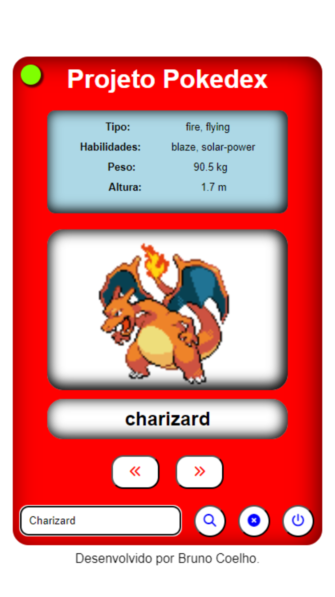

# PROJETO POKEDEX
## Projeto com utilização de API
### Aplicativo web destinado aos fãs de Pokémon

Desenvolvi este projeto com a finalidade de treinar minhas habilidades como desenvolvedor front-end buscando a utilização de uma API. O projeto também é otimizado para dispositivos móveis.

## Tecnologias Utilizadas
- API PokeAPI
- HTML
- CSS
- JAVASCRIPT
- GIT

## Funcionalidades

- [x] Botões interativos
- [x] Caixa(input) de pesquisa
- [x] Aba de visualização de texto e imagens

## Layout

## Demonstração

## Autor
Bruno Celho Muniz Silva
[Linkedin](https://www.linkedin.com/in/bruno-coelho-97b630220/)